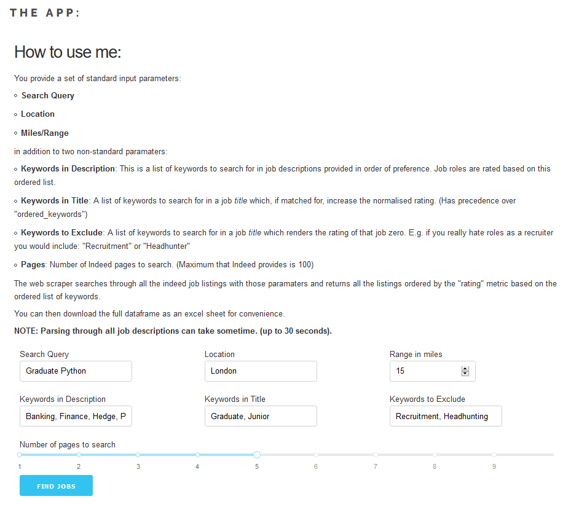
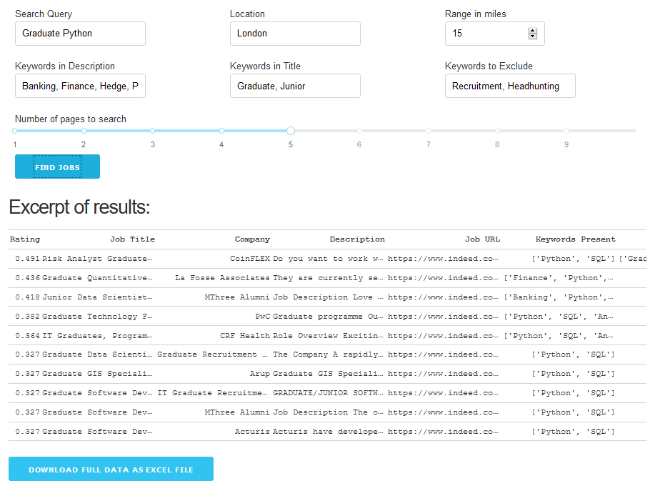
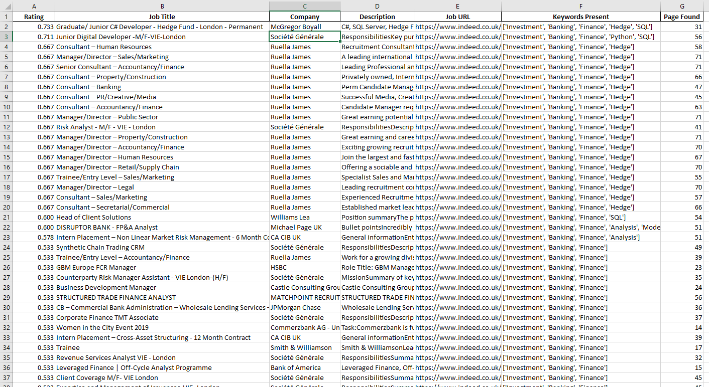

# What is this and how does it work?

### Find the web app here: 

https://umais.me/projects/indeed-job-scraper/

### What is this?

A bot that scrapes Indeed and parses job descriptions to return to you an ordered list of jobs based on your preferences.

### How it works?

You provide a set of standard input parameters: 
- **Search Query**
- **Location**
- **Miles/Range**

in addition to two non-standard paramaters: 
- **Keywords in Description**: This is a list of keywords to search for in job descriptions provided in order of preference. Job roles are rated based on this ordered list. 
- **Keywords in Title**: A list of keywords to search for in a job _title_ which, if matched for, increase the normalised rating. (Has precedence over "ordered_keywords")
- **Keywords to Exclude**: A list of keywords to search for in a job _title_ which renders the rating of that job zero. E.g. if you really hate roles as a recruiter you would include: "Recruitment" or "Headhunter"
- **Pages**: Number of Indeed pages to search. (Maximum that Indeed provides is 100)

The web scraper searches through all the indeed job listings with those paramaters and returns all the listings ordered by the "rating" metric based on the ordered list of keywords.

You can then download the full dataframe as an excel sheet for convenience. 

**NOTE2: Excel hyperlinks are limited to 255 characters. Many of the job URLs exceed this limit, as such they are formatted as strings in the excel output.** 

### Web App Interface

### Web App Output

### Example Excel Output

### Example Dataframe if using Jupyter Notebook:

### What's New: 

- Multiprocessing. Job pages are no longer searched sequentially but instead concurrently using MapPool from the Python MP library
- Web App! Front end programmed in Dash and hosting on a cloud PaaS (Heroku)
